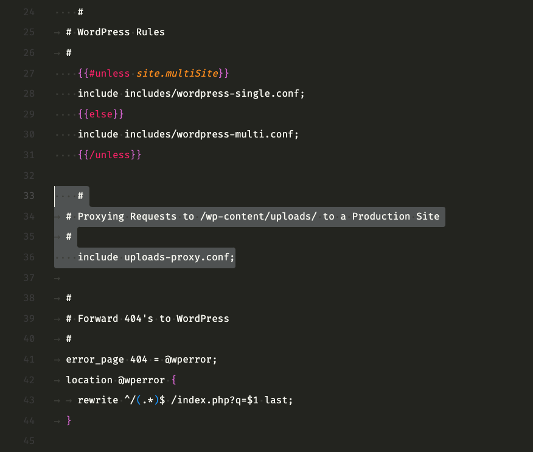

Welcome to the CME (Engage) Website documentation. This guide covers everything you need to know to work on the [WordPress site](https://mediaengagement.org/), including local development setup, theme structure, and best practices.

---

## First Day on the Job

For more in depth detail see [Technical Docs - First Day on the Job](/mediaengagement-technical-docs/#first-day-on-the-job)

1. **Logins**: Ensure you have logins for the WordPress site ([mediaengagement.org](https://mediaengagement.org)), WP Engine, and the appropriate permissions for the GitHub repository. Speak with the lead developer or your manager to get access.
  
2. **Setup**: Follow the [Installation](#installation) steps to set up your local environment. It’s recommended to use an IDE like Atom or Visual Studio Code for easier version control and syntax checking.
  
3. **Git Usage**: After your setup, familiarize yourself with our Git practices by reading the [Git Usage Docs](#git-usage).
  
4. **Explore Timber**: 

    - Check out this [Timber Syntax video](https://youtu.be/Toq3CXgwWgw?t=263) to familiarize yourself with Timber and Twig.

      _You can watch the whole video, but it covers the old way of using Timber through a plugin. Timber is now part of the theme code so disregard the plugin installation parts._
      
    - Read [Timber and Twig Reignited My Love for WordPress](https://css-tricks.com/timber-and-twig-reignited-my-love-for-wordpress/).
    
    - Read the [Timber Docs Introduction](https://timber.github.io/docs/v2/getting-started/introduction/).
    
    - We use Advanced Custom Fields in our engage-2-x/Timber theme so check out this [WordPress Advanced Custom Fields video](https://www.youtube.com/watch?v=eMCOE9x5mCc) to get familiar with how the plugin works.

5. **Explore WordPress**: If you’re new to WordPress, take some time to explore the admin panel on your local environment. Feel free to experiment—any issues can be reverted with `git reset --hard origin/master`. Commit frequently and work in new branches.

##### _Pro Tips:_

- Changes to the frontend are typically located in the templates or SCSS files under the `assets` folder.
- Backend logic and queries are in the `src` folder, but loose PHP files may also be found throughout.

	<details>
		<summary><strong>More info</strong></summary>

		<p>When it comes to the code, you'll be working under the engage-2-x directory <code>~/Local Sites/mediaengagementorg/app/public/wp-content/themes/engage-2-x</code>. It will take some time to get used to the structure and knowing where in the code you need to access for your project. To help get you going in the right direction, if the change you're making is to the front-end you'll want to look inside the templates folder and SCSS under assets. Backend logic and querying happen inside of PHP files, the src folder has a lot of it, but there are some lose PHP files out and about.</p>
		
		<p>Check out the <a href="#theme-structure">Theme Structure</a> section for more info.</p>

	</details>

---

## Installation

For more in depth detail see [Technical Docs - Sync with GitHub](/mediaengagement-technical-docs/#syncing-with-github)

### Step 1: Install Local App
- Download and install [WP Engine Local App](https://localwp.com/).

### Step 2: Import the .zip
- Request the lead dev for a "slimmer" version of the site.

- In the Local App, click the plus (+) icon and select "Existing ZIP" to import the site. 

- Configure: PHP 8.2.10+, Nginx, and MySQL 8.0.16+.

- Next step it will import. When it is done you can click the "WP Admin" button to open the WordPress Dashboard. Temporary login:

  - Username: `adminDev`
  - Password: `adminDev`
  
After you log in you should add yourself as an "Administrator" user in WP Admin / Users / Add new.

### Step 3: Add Proxy URL to `webpack.mix.js`
- Create a `config.json` file in the theme root:
  ```json
  {
    "proxy": "http://localhost:10000"
  }
  ```
  
For more in depth detail see [Technical Docs - Set proxy URL in webpack.mix.js](/mediaengagement-technical-docs/#3-set-proxy-url-in-webpackmixjs)
  
### Step 4: Proxy Requests for `/wp-content/uploads/`
- Set up a proxy to save storage on you local machine by fetching images from the live/production site. If this step is not completed your local site willnot show any images.

  <details>
  <summary><strong>How to configure the proxy</strong></summary>

    <ol>
      <li>
      <p>Create a file named <code>uploads-proxy.conf</code> in the <code>siteRoot/conf/nginx</code> directory with this content:</p>
      <pre class="highlight"><code>
location ~ ^/wp-content/uploads/(.*) {
    if (!-e $request_filename) {
        rewrite ^/wp-content/uploads/(.*) https://mediaengagement.org/wp-content/uploads/$1 redirect;
    }
}
      </code></pre>
      </li>
      
      <li>
      <p>Open <code>siteRoot/conf/nginx/site.conf.hbs</code> in your editor and add the below snippet below the <code>{{</code><code>/unless}}</code> line in the `# WordPress Rules`:</p>
          
      <pre class="highlight"><code>
  include uploads-proxy.conf;
      </code></pre>
        
      <p>Your updated <code>site.conf.hbs</code> hould look like this screenshot:</p>
      
      </li>
        
      <li>Save and restart the site in the Local App.</li>
    </ol>
	</details>

### Step 5: Sync with GitHub

In terminal navigate into `~/[site root]/app/public` and enter the following commands to initialize the repository and set the remote origin:

```bash
git init
git remote add origin https://github.com/engagingnewsproject/enp-platform.git
git fetch --all
git reset --hard origin/master
```

Now you should be connected to the GitHub Repo and in sync with the `master` branch. To confirm this run:

```bash
git remote -v
```

Output should be something like:

```bash
origin  https://github.com/engagingnewsproject/enp-platform.git (fetch)
origin  https://github.com/engagingnewsproject/enp-platform.git (push)
```
  
---

## Local Development

### Initial Setup

You will only need to run the Initial Setup once. 

Be sure to run below steps 1-4 from the `engage-2-x/` theme directory:

`[site root]/app/public/wp-content/themes/engage-2-x`

##### Step 1: Install `nvm`

If not installed already, install `nvm` (Node version manager) on your local machine. 

- [See `nvm` installation instructions here.](https://www.freecodecamp.org/news/node-version-manager-nvm-install-guide/)

##### Step 2: Create `.nvmrc` file

Create a `.nvmrc` file in your `[site root]/app/public/` directory with one line as the content:

```bash
8.7.0
``` 

##### Step 3: Switch Node Version
Use the Node version in the `.nvmrc` file:
```bash
nvm use
```

##### Step 4: Install Dependencies
```bash
npm install
```

### Boot up local server

##### Step 1: Create a branch for your task

First create a new local branch according to the [Quick Working Development Guide](/mediaengagement-technical-docs/#quick-working-development-guide)

##### Step 2: Start Development Environment
The `watch` command below boots up your local dev server with live reloading. From the `engage-2-x/` theme directory run:
```bash
npm run watch
```

To close your local dev server hit `control + c`.

> Important to run the command below when you are done working on your task and ready to push to origin.

##### Step 3: Build for Production
Before pushing changes, compile and minify the assets:
```bash
npm run production
```

Now you can push your changes to the remote origin.

Technical Docs - [Local development](/mediaengagement-technical-docs/#local-development)

---

## Coding Guidelines

### Files You Should Not Edit

It’s important to understand that certain files and folders in the `engage-2-x/` directory/theme the should never be manually edited because they are automatically generated or managed by external tools. Editing these files can lead to confusion, break the site or cause your changes to be overwritten.

1. **`dist/` Folder**: Contains compiled files. Do not edit them.
2. **`node_modules/` Folder**: Contains npm dependencies. Managed automatically.
3. **`vendor/` Directory**: Contains PHP dependencies, managed by Composer.
4. **`config.json`**: Each developer manages their own local version.
5. **`.lock` Files**: Managed by Composer and npm, don't edit manually.
6. **`mix-manifest.json`**: Automatically generated, no need to change.

For more in depth detail see [Technical Docs - Coding Guidelines](/mediaengagement-technical-docs/#files-you-should-not-edit)

### Best Practices

1. **Performance**: Always consider the performance impact of your changes.

2. **Modularity**: Functions should do one thing and be easily testable.

3. **Code Simplicity**: Prioritize simple, well-documented code over clever or complex solutions.

### Git Usage

- Always create separate branches for new features or bug fixes.
  - For more in depth detail see [Technical Docs - Git Usage](/mediaengagement-technical-docs/#git-usage)


- Push to the `master` branch only after code review and testing.
  
For more detailed Git workflows, see [Technical Docs - Quick Working Development Guide](/mediaengagement-technical-docs/#quick-working-development-guide).

---

## SCSS Guidelines

For more in depth detail see [Technical Docs - CSS](/mediaengagement-technical-docs/#css)

### Workflow
- Use **mobile-first** design when writing styles.
- Compile and minify SCSS files to `dist/css/app.css` by running:
  ```bash
  npm run production
  ```

### BEM Naming Conventions
- `.block__element` for elements.
- `.block--modifier` for modifiers.

---

## Theme Structure

Engage uses the **Timber** framework and **Twig** templating engine. Familiarize yourself with:
- [Timber Documentation](https://timber.github.io/docs/v2/)
- [Twig Documentation](https://twig.symfony.com/doc/3.x/intro.html)

---

## Plugins

### ENP Registration Plugin
- Refer to the [ENP Registration plugin](https://github.com/engagingnewsproject/enp-custom-registration) for custom registration details.

### SEO (Rank Math)
- Follow [Rank Math guidelines](https://rankmath.com/kb/score-100-in-tests/) for SEO optimization.

---

## Deployment Workflow

### Branching Strategy
- `master`: Main working branch.
- `stable`: Represents the production state.
- **Features/Issues**: Use branches like `feature-*` or `bug-*` for development.

### Deployment Steps
1. Push to **Dev** for testing.
2. Merge into **Stable** and tag the release.
3. Push to **Staging** for final approval.
4. Deploy to **Production**.

### Git Push with WP Engine
- Add your SSH key and set up remote repositories for WP Engine production and staging environments.

---

## Troubleshooting

### Valet Conflicts
Stop Valet if using Local by Flywheel:
```bash
valet stop
```

### WP-CLI Commands
- **Check for Updates**: `wp plugin list --update=available`
- **Optimize Database**: `wp db optimize`

## Technical Docs

- [View Technical Docs](/mediaengagement-technical-docs/)